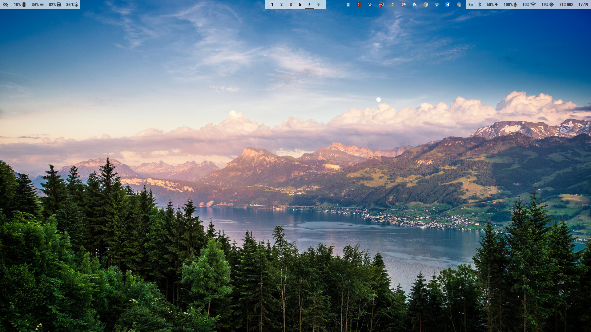
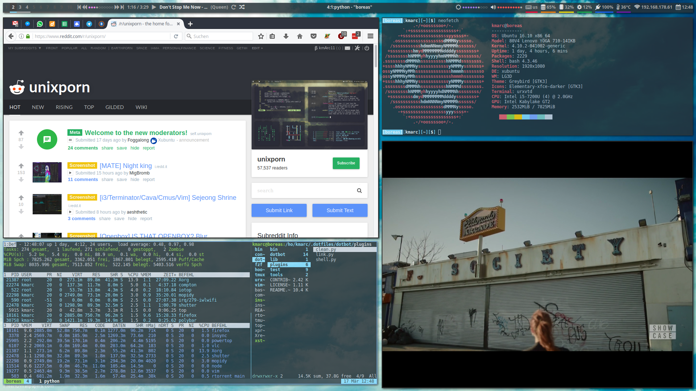
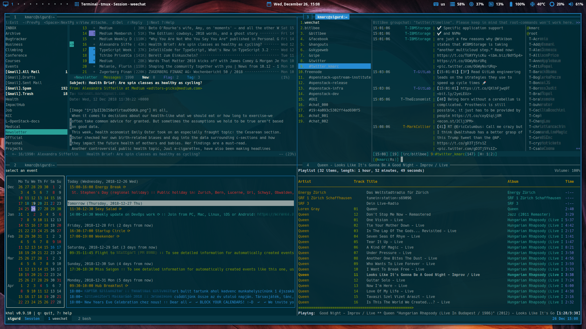

# kmARC's Dotfiles

<a href="images/desktop-empty.png"></a>
<center>
<a href="images/desktop-full.png"></a>
<a href="images/desktop-terminal.png"></a>
</center>

(Wallpaper: http://gallery.world/wallpaper/520.html)

## Console

Tested on Ubuntu Server 16.10

``` bash
sudo apt install git python tmux
git clone https://github.com/kmARC/dotfiles ~/.dotfiles
cd ~/.dotfiles && git submodule update --init && ./install && cd -
```

Re-login / restart bash.

### Configuration

To select a theme, type `base16_<TAB>` and you'll see the fantastic theme
collection from [base16]. My preference is...

    base16_materia

[base16]: https://github.com/chriskempson/base16

### Install basic apps

The following apps are configured via this dotfiles repository.

``` bash
sudo apt install htop mc mutt
```

These are  some handy  tools what I  like however not  (yet!) configured  by the
dotfiles.

``` bash
sudo apt install dfc iotop powertop rar tlp zip
```

## Desktop

### Install basic apps

``` bash
sudo apt install elementary-icon-theme fonts-noto lightdm lightdm-gtk-greeter xfce4-appfinder xfce4-panel xfce4-power-manager xfce4-pulseaudio-plugin xfce4-settings x11-utils x11-xserver-utils xinit xinput xscreensaver
sudo apt install consolekit compton dex feh jq mpc rxvt-unicode-256color xcape xsel
```

### Install bspwm and sxhkd

``` bash
mkdir -p ~/.local/src

# prerequisites
sudo apt install build-essential
sudo apt install libxcb-{xinerama0,icccm4,randr0,util,ewmh,keysyms1}-dev

# bspwm
git clone https://github.com/baskerville/bspwm.git ~/.local/src/bspwm
cd ~/.local/src/bspwm
make
sudo make install
cd -

# sxhkd
git clone https://github.com/baskerville/sxhkd.git ~/.local/src/sxhkd
cd ~/.local/src/sxhkd
make
sudo make install
cd -
```

### Install Polybar

[Fontawesome]

``` bash
mkdir -p ~/.fonts
wget http://fontawesome.io/assets/font-awesome-4.7.0.zip -P /tmp
unzip /tmp/font-awesome-4.7.0.zip -d ~/.fonts
fc-cache -f
```

[Polybar]

``` bash
sudo apt install cmake pkg-config
sudo apt install libasound2-dev libcairo2-dev libcurl4-openssl-dev \
                 libmpdclient-dev libxcb-xkb-dev libxcb-image0-dev \
                 libiw-dev xcb-proto

git clone --recursive https://github.com/jaagr/polybar ~/.local/src/polybar
mkdir ~/.local/src/polybar/build
cd ~/.local/src/polybar/build
cmake ..
make -j5
sudo make install
cd -
```

[Fontawesome]: http://fontawesome.io/
[Polybar]: https://github.com/jaagr/polybar

### Install packages from Webupd8

``` bash
sudo add-apt-repository ppa:nilarimogard/webupd8 
sudo apt update
sudo apt install arc-theme qt5ct ncmpcpp
```

### Configuration

To select a wallpaper, use `feh`.

``` bash
feh --bg-fill path_to_wallpaper
```


### (Optional) Install Mopidy (Spotify & TuneIn)

``` bash
sudo apt install python-pip

wget -q -O - https://apt.mopidy.com/mopidy.gpg | sudo apt-key add -
sudo wget -q -O /etc/apt/sources.list.d/mopidy.list https://apt.mopidy.com/jessie.list
sudo apt-get update
sudo apt-get install mopidy mopidy-spotify
sudo pip install Mopidy-TuneIn
```

### Restart your desktop

You can use either `startx` or
