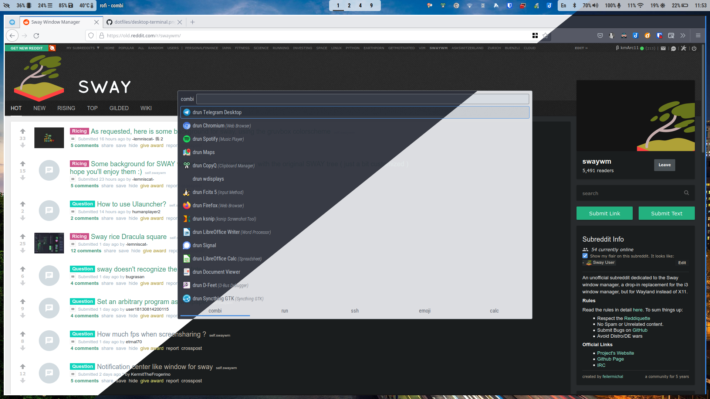

# kmARC's dotfiles

<p align="center">
  <a href="images/desktop-terminal.png"></a>
  <a href="images/desktop-full.png"></a>
  <a href="images/desktop-empty.png"></a>
</p>

- Wallpaper: https://github.com/elementary/wallpapers/blob/master/Ashim%20DSilva.jpg
- VIM configuration: https://githu.bom/kmarc/vim

## Installation on Arch Linux

### AUR packages (`yay`)

I'm using [yay] to acquire packages from [AUR].

``` bash
# Install preqrequisited
sudo pacman -Syu
sudo pacman -S base-devel git

# Don't forget to tune /etc/makepkg.conf (MAKEFLAGS="-j3" / "-j5")
sudo vi /etc/makepkg.conf

# Acquire yay PKGBUILD
mkdir -p /tmp/yay
git clone https://aur.archlinux.org/yay.git /tmp/yay
cd /tmp/yay

# Install yay
makepkg -si
```

[yay]: https://aur.archlinux.org/packages/yay/
[AUR]: https://aur.archlinux.org

### Dotfiles

> Note: You might want to create your own fork from this repo and `clone` the fork.

``` bash
# Install prerequisites
sudo pacman -S python tmux

# Clone dotfiles repository
git clone --recursive --depth=1 https://github.com/kmARC/dotfiles ~/.dotfiles

# Install symlinks
~/.dotfiles/install
```

Re-login / restart bash.

### Shell & color theme

This setup is based on the [solarized] theme. Follow the instructions there to customize / set it up
properly.

[solarized]: https://github.com/altercation/solarized

### Bash customizations

There are some customizations in my bashrc. Install and enable them as you like.

``` bash
# Install prerequisites (select what you need. Order is the same as in .bashrc.kmarc)
yay -S fzf \
       nvm \
       tmux \
       direnv \
       todotxt xdg-user-dirs \
       ripgrep \
       liquidprompt

# Enable bashrc customizations
echo "source $HOME/.bashrc.kmarc" >> "$HOME/.bashrc"
```

## Misc dependencies

Have a look at  [install.conf.yaml](install.conf.yaml) to get a hint on  what software is configured
with these dotfiles. Here is a categorization of what you might want to use from my repo.

### Productivity: Mail + Calendar + Contacts

I  have  a  95% terminal-based  workflow  for  Mail  ([neomutt]),  Calendar ([khal]),  and  Contacts
([khard]). All configured  to work together with  GMail/Google Suite, and Office  365. Calendars are
syncronized from all these sources and from facebook. All from terminal!

```bash
# Mail
sudo pacman -S neomutt offlineimap libsecret
yay -S urlscan mutt-ics
sudo pacman -S notmuch  # Fast email indexing support
sudo pacman -S pandoc   # HTML email editing support
yay -S davmail          # o365 synchronization support

# Calendar + Contacts
sudo pacman -S khal khard vdirsyncer python-requests-oauthlib
```

Neomutt  configuration resides  in [muttrc](muttrc)  and [mutt/muttrc.\_gmail_](mutt/muttrc._gmail_)
and [mutt/muttrc.\_owa_](mutt/muttrc._owa_).  However, it  sources `~/.pdotfiles/muttrc`,  where _p_
stands  for _private_,  thus not  included  in this  repository. You  can  find examples  on how  to
configure tools in  the [pdotfiles](pdotfiles) directory. Note: *.pdotfiles* setup  is not automated
by this repository.

[neomutt]: https://neomutt.org/
[khal]: https://lostpackets.de/khal/
[khard]: https://github.com/scheibler/khard/

### Graphical system

Yay, this setup is using wayland now! Thes instructions will be updated on-demand. Feel free to
contact me.

``` bash
sudo pacman -S \
  sway \
  waybar
```

### Music player

An MPD compatible daemon, [mopidy] is responsible for my daily music intake. For configuration, see
examples in [pdotfiles/](pdotfiles/)

``` bash
# Install / upgrade mopidy
yay -S mopidy-{spotify,soundcloud,tunein,mpris,mpd}
```
[mopidy]: https://www.mopidy.com/

### Apps & Tools

Have a look at the [sway configuration](config/sway/config) and customize the launchable apps /
tools

``` bash
# Sxhkd shortcuts
sudo pacman -S \
  alacritty \
  firefox \
  mpc \
  ranger \
  thunar
yay -S \
  rofi-emoji
```

### GUI themes

That's a mess with Xorg/Wayland/Gtk2/Gtk3/Qt4/Qt5

I keep it  simple: using [Arc] GTK and  icon themes, configured Qt/KDE applications to  pick up gtk2
theme settings. `lxappearance` is a handy tool to set gtk2/3 themes.

[Arc]: https://github.com/horst3180/Arc-theme

``` bash
sudo pacman -S arc-{gtk,icon}-theme elementary-icon-theme gtk-engine-murrine lxappearance \
          qt5-styleplugins
```
